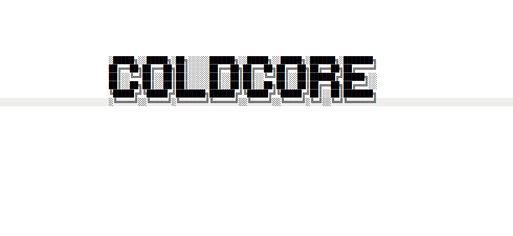
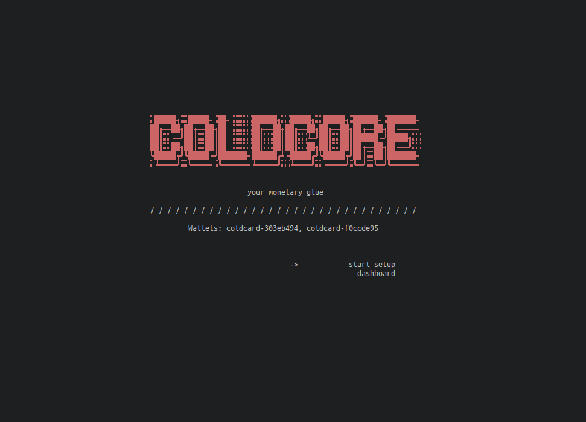
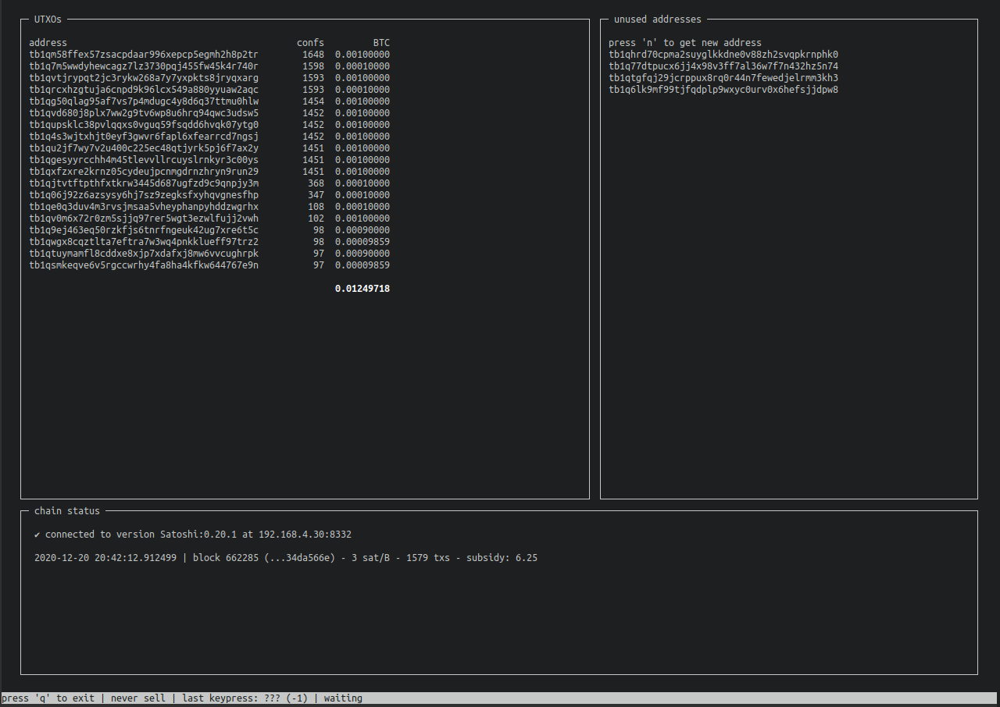

**This is experimental software. Wait for a formal release before use with real
funds.**

A trust-minimized Bitcoin wallet interface

- Zero install process
- Never touches your key material
- Modern: works in terms of script descriptors and PSBTs
- Minimal dependencies: Bitcoin Core, Python 3 interpreter. No GUI, no indexing server,
  just Core RPC.
- Supports only airgapped, opensource hardware wallets
- Integrates with GPG and [`pass`](https://www.passwordstore.org/) for secure xpub storage


In short, this is the easiest way to do air-gapped wallet management with Bitcoin Core,
Coldcard, and not much else.

## Requirements

- Linux or MacOS
  - Support for Windows is desired, but I'll need someone with a Windows computer to
    help
- Bitcoin Core 0.18+
- Python 3.7+ (your system probably already has this)



## Install process

1. Buy a [Coldcard](https://coldcardwallet.com)
1. Download, install, and sync [Bitcoin Core](https://bitcoincore.org/en/download/)
1. Ensure Python 3.7+ is on your system: `$ python --version` and if not, install it.
  - macOS: install [homebrew](https://brew.sh/), run `brew install python3`
  - [Linux](https://realpython.com/installing-python)
1. Clone this repo: `git clone https://github.com/jamesob/coldcore`
1. Make coldcore executable and run it
  - `cd coldcore; chmod +x coldcore; ./coldcore --help`
1. Optionally, install coldcore to your path
  - `cp coldcore ~/.local/bin/coldcore  # or somewhere on your PATH`

### Verifying the install (optional but recommended)

1. Receive my keys in GPG:
  - `gpg --keyserver keyserver.ubuntu.com --recv-keys 0x25F27A38A47AD566`
  - You can verify this fingerprint on my Twitter: https://twitter.com/jamesob
1. Get the sigs for the release:
  - Get the signature: `curl -O http://img.jameso.be/sigs/coldcore-$(./coldcore --version).asc`
  - Verify the signature: `gpg coldcore-[version].asc`
  - Ensure it matches: `sha256sum coldcore`

### Zero install process

As long as you have Bitcoin Core and a Python 3.7 (or greater) installation, you're
ready to go. No dealing with package managers, no dependencies. This is all
standard-library Python that likely shipped with your OS.

### Minimal dependencies

Other wallets require big indexing servers that take hours to set up (*after* initial
block download), consume tens of gigabytes of space, and are confusing to configure
even for software engineers.

This is a single script that most people with basic programming knowledge can at least
skim.

Other wallets require graphical runtimes (GUI toolkits, browsers) that not only entail
much more code, but are more prone to [exploits](https://snyk.io/vuln/npm:electron).
Handling wallet operations through Chrome just isn't appropriate beyond a certain
point; browser makers could conceivably collect or manipulate data, and what about those
plugins you have installed? Who wants to audit Qt? Not me.



This script uses only terminal interfaces, and one of the design goals is to make them
approachable for people who haven't previously interacted with the command line much.
So if you've been wanting to learn about the shell, this is a pretty good opportunity.


```
github.com/AlDanial/cloc v 1.86  T=0.04 s (27.3 files/s, 84781.1 lines/s)
-------------------------------------------------------------------------------
Language                     files          blank        comment           code
-------------------------------------------------------------------------------
Python                           1            673            313           2123
-------------------------------------------------------------------------------
```

### Air-gapped hardware wallet support

This library will only support air-gapped interaction with hardware wallets that are
opensource. Right now, that means that Coldcard is the only key storage mechanism
supported, but I'm happy to add others that fit the criteria of

- being opensource, and
- supporting air-gapped interaction.


## Status

While this script is relatively simple, and I'm *pretty* sure there aren't any ways to
lose funds using it (knock wood), it is young and therefore in alpha. Some bugs are
only shallow under time, so unless you're a highly technical user who can scrutinize
the code pretty closely, hold off on using this for a few months.


## Security assumptions

- Your xpub data is stored in a watch-only wallet in Bitcoin Core.
- This script doesn't touch your private keys.
- This script doesn't do any cryptography aside from optionally generating and
  checking xpub fingerprints.


## Configuration

### Environment variables

- `COLDCORE_CONFIG`: a path to your configuration. If this is of the form
  `pass:Some/Path`, it will run `pass show Some/Path` to retrieve your config. If
  the path ends in `.gpg`, we will use GPG to decrypt the configuration.

- `COLDCORE_GPG_KEY`: if you want to use GPG to encrypt your config file (without
  using pass), set this environment variable to the key to use for encryption. We
  will also read `~/.gnupg/gpg.conf` for the `default-key` setting.

### Global flags

#### `coldcore --rpc <url>`

#### `coldcore --wallet <wallet-name>`

## FAQ

### Why did you use Python?

### Why do you encrypt the config file by default with GPG?
